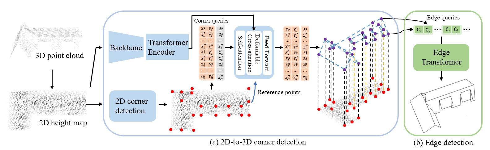

# BWFormer
**BWFormer: 3D Building Wireframe Reconstruction from 2D Height Map with Transformer**

Yuzhou Liu, Lingjie Zhu, Hanqiao Ye, Xiang Gao, and ShuhanShen

Institute of Automation, Chinese Academy of Sciences

Please keep tuned and we will release the code upon paper acceptance!
## Abstract
In this paper, we present BWFormer, a novel Transformer-based architecture for 3D building wireframe reconstruction from 2D height maps. Traditional methods reconstruct building wireframe directly from airborne LiDAR point clouds, facing the challenges of sparse, incomplete, and unevenly distributed point clouds. To avoid the downsampling of 3D backbone, we project the point clouds along the vertical axis to generate height maps and solve the 3D building wireframe reconstruction problem with them in 2D. Due to the 2.5D data characteristic, there is no roof plane occlusion, which makes it possible to restore the roof structures from the height map. With the height map, a 2D corner heat map is first predicted with pixel-wise corner likelihood, which is then used to initialize the 3D corner queries. After that, with the added height embeddings, 3D corner queries are predicted within smaller search space with a Transformer network. Finally, with corners detected, edges are predicted with the endpoint coordinates and image features based on the deformable attention. Our method surpasses other state-of-the-art methods, especially in reconstruction completeness.
## Method

 **Overall architecture of BWFormer.** With a 2D height map projected from 3D point cloud, BWFormer first detects 2D corners, and initializes the 3D corner queries with 2D positions. Then, with a Transformer-based network, the 3D corners are predicted. Finally, edges with two 3D corners (c_{i}, c_{j}) as the endpoints are classified as valid or not while valid edges form the final wireframe. Corner queries are in the dimension of MN*3, and ($$X_{i}^{j}$$, $$Y_{i}^{j}$$, $$Z_{i}^{j}$$) indicates the j-th corner initialized with the i-th possible 2D position. The predicted coordinates are marked as orange while the unpredicted are marked as gray. Besides, 2D corners are marked as red while 3D corners are purple. Lines marking the 2D-3D correspondences are black for one-to-one correspondence while they are yellow for one-to-many.
 

