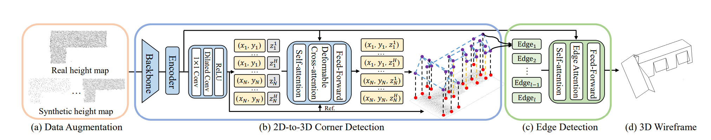

# [CVPR2025] BWFormer: Building Wireframe Reconstruction from airborne LiDAR point clouds with Transformer 
Official implementation of 'BWFormer: Building Wireframe Reconstruction from airborne LiDAR point clouds with Transformer'. 

:trophy::trophy: Won 1st place in Building3D Challenge at CVPR2024 and CVPR2025.

## Abstract
In this paper, we present BWFormer, a novel Transformerbased model for building wireframe reconstruction from airborne LiDAR point cloud. The problem is solved in a ground-up manner here by detecting the building corners in 2D, lifting and connecting them in 3D space afterwards with additional data augmentation. Due to the 2.5D characteristic of the airborne LiDAR point cloud, we simplify the problem by projecting the points on the ground plane to produce a 2D height map. With the height map, a heat map is first generated with pixel-wise corner likelihood to predict the possible 2D corners. Then, 3D corners are predicted by a Transformer-based network with extra height embedding initialization. This 2D-to-3D corner detection strategy reduces the search space significantly. To recover the topological connections among the corners, edges are finally predicted from the height map with the proposed edge attention mechanism, which extracts holistic features and preserves local details simultaneously. In addition, due to the limited datasets in the field and the irregularity of the point clouds, a conditional latent diffusion model for LiDAR scanning simulation is utilized for data augmentation. BWFormer surpasses other state-of-the-art methods, especially
in reconstruction completeness.
## Method


**Overall architecture of BWFormer.** With real height maps projected from point clouds and synthetic ones from simulated LiDAR scans (a), BWFormer first detects 2D corners and initializes the 3D corner queries with 2D positions. Then, with a Transformerbased network, the 3D corners are predicted (b). Finally, edges are classified as valid or not (c) while valid ones form the final wireframe (d). ($x_i$, $y_i$, $z^j_i$) indicates the j-th corner initialized in the i-th possible 2D position. The predicted coordinates are in the yellow box while the unpredicted ones are in the gray ones. Besides, 2D corners are marked as red while 3D ones as purple. Lines marking the 2D-3D correspondences are black for one-to-one correspondences while yellow for one-to-many ones. $l$ indicates the number of candidate edges.

## Environment
```
pip install -r requirements.txt
cd  models/ops/
sh make.sh
cd ...
```

## Data
The processed dataset of building3d is stored in [this link](https://drive.google.com/file/d/1D7oqz4A2e4kXEFd2J8jtcHpx-QjqB8Cp/view?usp=drive_link). To get the final wireframe model, also download the building3d dataset. Put them in the building3d directory.

## Data preprocessing
For your custom dataset, use [proj.py](https://github.com/3dv-casia/BWformer/blob/main/proj.py) to construct your own dataset with our format.

## Training 
```
CUDA_VISIBLE_DEVICES=0,1 python -m torch.distributed.launch --nproc_per_node=2 train.py  --exp_dataset outdoor  --epochs 650 --lr_drop 600  --batch_size 56  --output_dir ./checkpoints/building3d/  --image_size 256  --max_corner_num 150  --lambda_corner 0.05 
```
## Inference 
```
python infer.py --checkpoint_path ./checkpoints/checkpoint.pth  --dataset outdoor --image_size 256
```

## Checkpoints
The checkpoints can be downloaded in [this link](https://drive.google.com/file/d/1qvwUUL8Zjpv33rb1F7Ew0DUUvv5tkqbs/view?usp=drive_link).

## Citation
If you find BWFormer useful in your research, please cite our paper:
```
@inproceedings{liu2025bwformer,
  title={BWFormer: Building Wireframe Reconstruction from Airborne LiDAR Point Cloud with Transformer},
  author={Liu, Yuzhou and Zhu, Lingjie and Ye, Hanqiao and Huang, Shangfeng and Gao, Xiang and Zheng, Xianwei and Shen, Shuhan},
  booktitle={Proceedings of the Computer Vision and Pattern Recognition Conference},
  pages={22215--22224},
  year={2025}
}
```

## Acknowledgment
We thank the following excellent projects especially HEAT:
* [DETR](https://github.com/facebookresearch/detr)
* [Deformable-DETR](https://github.com/fundamentalvision/Deformable-DETR)
* [Detectron2](https://github.com/facebookresearch/detectron2)
* [HEAT](https://github.com/woodfrog/heat)


 


